# Ledgerly — Cross-Platform Expense Tracker for iOS & Android


A personal expense tracker built with React Native, running natively on both iOS and Android from a single JavaScript/TypeScript codebase — extended with platform-specific native modules and native views where the framework alone wasn't enough.

---

## Demo

📱 Clone the repository and run it locally on iOS or Android (see [Running Locally](#running-locally) below).

---

## Screenshots

### Login & Sign Up

Simulated authentication, with per-user account storage and validation against existing accounts.

Android:
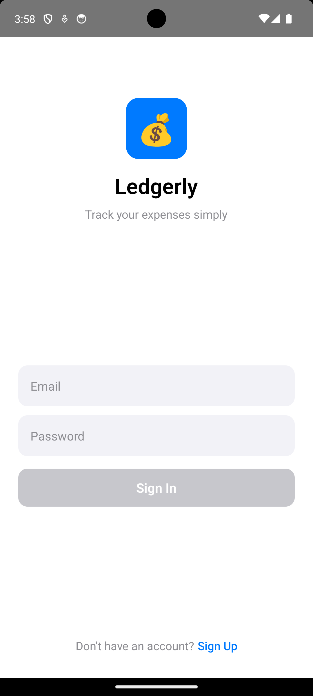

iOS:
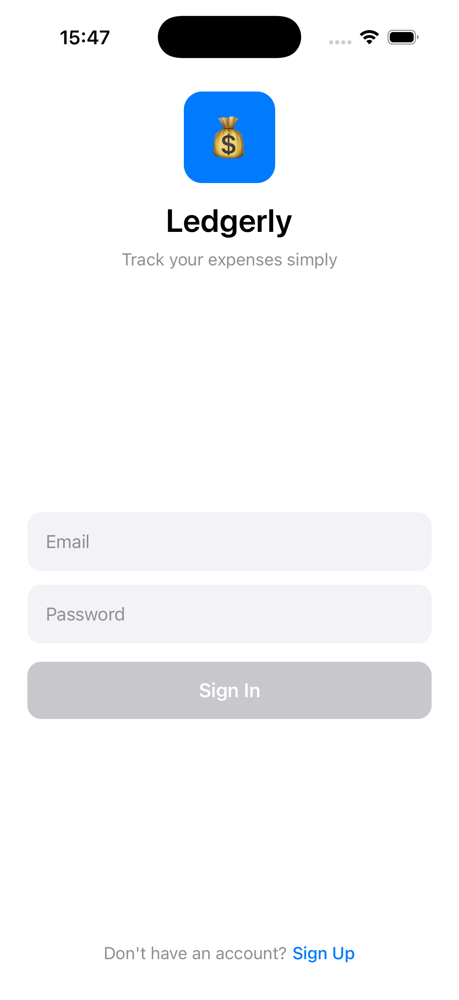

### Expense List

Search, filter by category, and swipe through all your registered expenses.

Android:
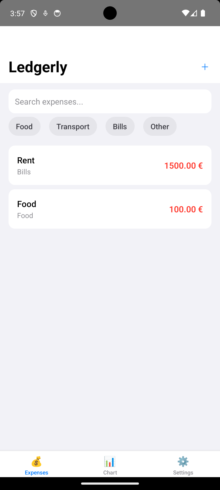

iOS:
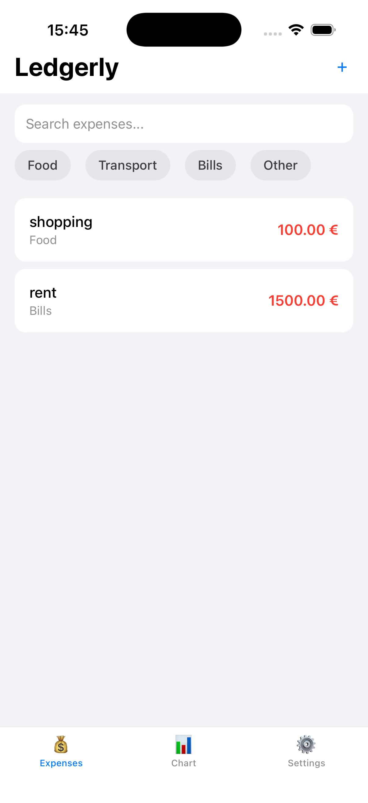

### Expense Detail

Full detail view with a native category badge and live currency conversion (USD / GBP / JPY).

Android:
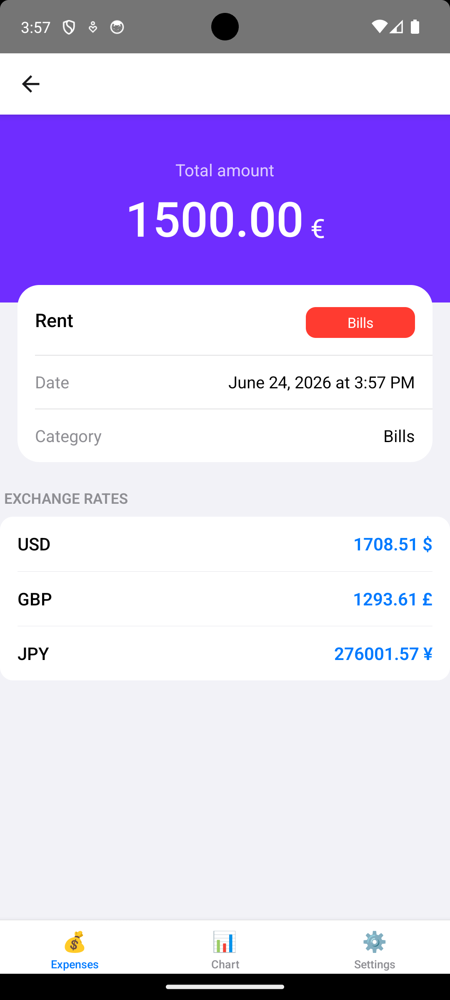

iOS:
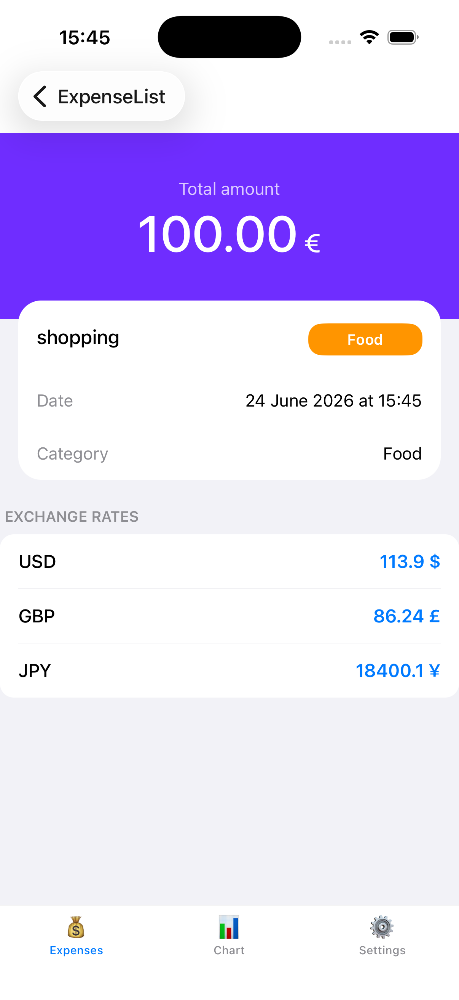

### Add Expense

Modal form with category picker and a spring-based save animation.

Android:
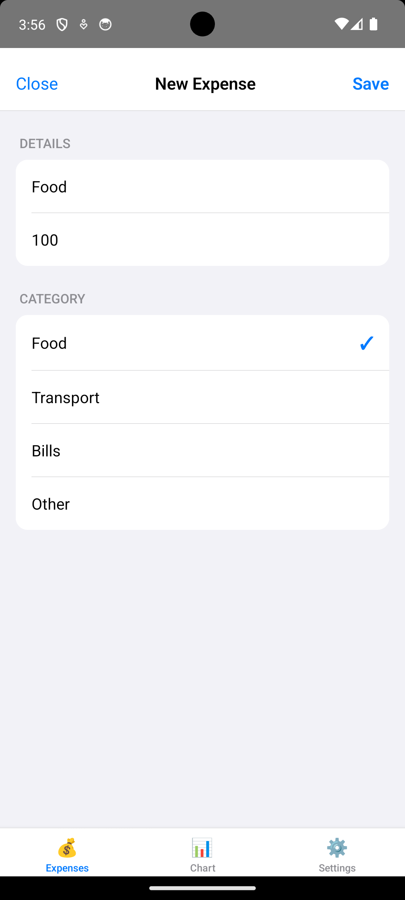

iOS:
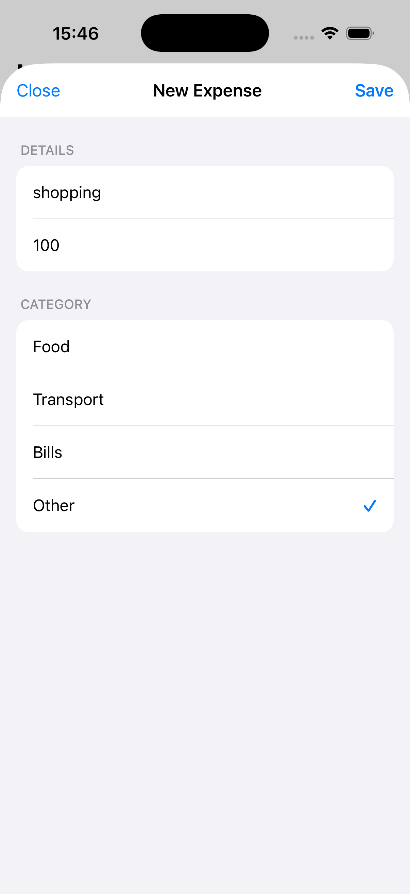

### Chart

Category breakdown with an animated bar chart (JS) alongside a fully native bar chart view (iOS/Android).

Android:
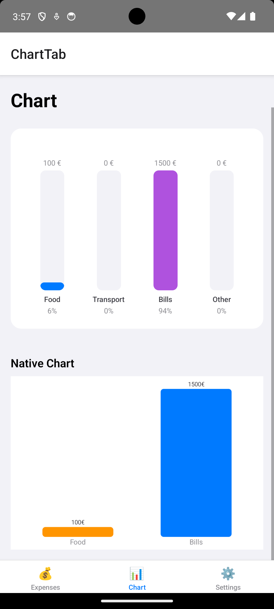

iOS:
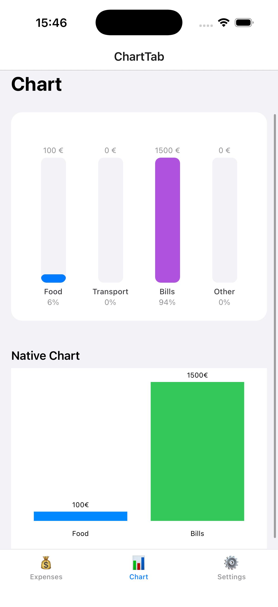

### Settings

Language switcher, notification toggle (native module), and live device info pulled from native code.

Android:
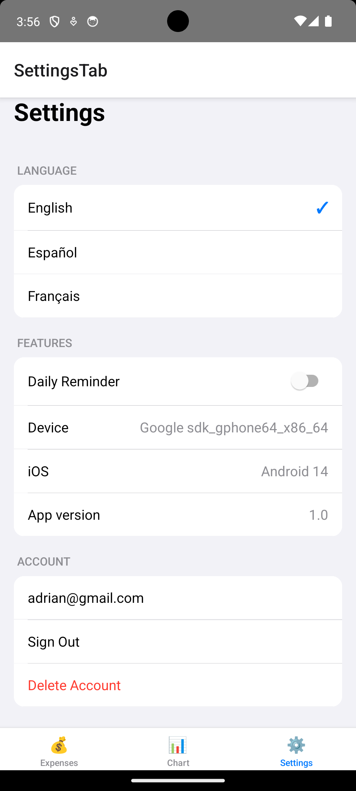

iOS:
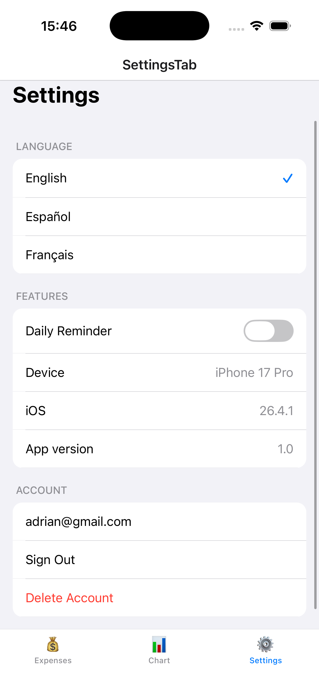

---

## Problem Statement

Most expense-tracking apps either lock you into a single platform's design language or hide their data behind a remote backend you don't control. Ledgerly was built as an academic and portfolio project to demonstrate that a single React Native codebase can:

- Run natively and consistently on both iOS and Android
- Persist data fully on-device, with no backend dependency
- Be extended with real native code (Objective-C / Kotlin) exactly where React Native's JavaScript layer isn't enough — notifications, device info, and custom-drawn native views

---

## Features

### Authentication (simulated)

- Sign up and log in per email/password, stored locally via AsyncStorage
- Logging in with a non-existent account is rejected; signing up with an already-used email is rejected
- Each user's expenses are fully isolated — no shared state between accounts
- Account deletion wipes the user's local data and signs them out

### Expense List

- Full-text search by title
- Horizontal category filter chips (Food / Transport / Bills / Other)
- Long-press to delete an expense
- Empty state when no expenses match the current filters

### Expense Detail

- Purple summary banner with the total amount
- Native `CategoryBadgeView` rendering the category with its accent color
- Live currency conversion to USD, GBP and JPY via a public exchange-rate API

### Add Expense

- Modal sheet with title, amount and category fields
- Spring-based "press" animation on the Save button (imperative animation with Reanimated)
- Writes directly to SQLite and updates the global store on success

### Chart

- Category totals computed from the local SQLite data
- Declarative entrance animation (`FadeInDown`) and imperative bar-growth animation (`withTiming` + `withDelay`), staggered per bar
- A second, fully native bar chart (`ExpenseChartView`) rendered with Core Graphics on iOS and Canvas on Android, fed the same translated data

### Settings

- Language switcher (Spanish / English / French) via i18next
- Notification toggle backed by a native `NotificationModule` (local notifications)
- Live device name, OS version and app version pulled from a native `DeviceInfoModule`
- Account deletion and sign-out

---

## Tech Stack

| Layer            | Technology                                                    | Reason                                                                                                            |
| ---------------- | ------------------------------------------------------------- | ----------------------------------------------------------------------------------------------------------------- |
| Framework        | React Native 0.85.3                                           | Single codebase for iOS and Android, required by the assignment                                                   |
| Language         | TypeScript                                                    | Type safety across store, services, navigation and native module wrappers                                         |
| State management | Zustand                                                       | Minimal global state for auth session and expense data, no boilerplate                                            |
| Navigation       | React Navigation (Native Stack + Bottom Tabs)                 | Native-feeling navigation with nested stacks per tab                                                              |
| Persistence      | react-native-sqlite-2                                         | Local relational storage for expenses, filtered per user                                                          |
| Auth storage     | @react-native-async-storage/async-storage                     | Lightweight local credential store for simulated authentication                                                   |
| Animations       | react-native-reanimated                                       | UI-thread animations, both imperative (`withSpring`, `withSequence`, `withTiming`) and declarative (`FadeInDown`) |
| Networking       | fetch                                                         | Live exchange-rate lookups from a public currency API                                                             |
| i18n             | i18next / react-i18next                                       | Spanish, English and French translations with instant language switching                                          |
| Native modules   | Objective-C (iOS) / Kotlin (Android)                          | Local notifications and device info, bridged via the old architecture (and partially the new architecture on iOS) |
| Native views     | Objective-C + Core Graphics (iOS) / Kotlin + Canvas (Android) | Custom-drawn bar chart and category badge rendered entirely with native UI APIs                                   |

---

## Project Structure

```
LedgerlyRN/
├── App.tsx                          #Entry point, renders AppNavigator
├── index.js                         #RN entry point
│
├── ios/
│   ├── NotificationModule.h/.m      #Native module — old architecture
│   ├── DeviceInfoModule.h/.m        #Native module — TurboModuleRegistry-accessed
│   ├── ExpenseChartView.h/.m        #Native view — Core Graphics bar chart
│   ├── ExpenseChartViewManager.h/.m
│   ├── CategoryBadgeView.h/.m       # Native view — colored category badge
│   └── CategoryBadgeViewManager.h/.m
│
├── android/app/src/main/java/com/ledgerlyrn/
│   ├── NotificationModule.kt        #Native module — old architecture
│   ├── DeviceInfoModule.kt
│   ├── ExpenseChartView.kt          #Native view — Canvas bar chart
│   ├── ExpenseChartViewManager.kt
│   ├── CategoryBadgeView.kt
│   ├── CategoryBadgeViewManager.kt
│   └── LedgerlyPackage.kt           #Registers all native modules & view managers
│
└── src/
    ├── models/
    │   └── Expense.ts               #Expense interface + category constants
    │
    ├── store/
    │   ├── authStore.ts             #Zustand — simulated auth, AsyncStorage-backed
    │   └── expenseStore.ts          #Zustand — expenses + active filters
    │
    ├── services/
    │   ├── SQLiteService.ts         #CRUD operations against the local SQLite DB
    │   └── CurrencyService.ts       #fetch-based exchange rate lookups
    │
    ├── modules/
    │   ├── NotificationModule.ts        #JS wrapper — old architecture
    │   ├── DeviceInfoModule.ts          #JS wrapper — TurboModuleRegistry
    │   └── NativeDeviceInfoModule.ts    #TurboModule spec
    │
    ├── components/
    │   ├── ui/
    │   │   ├── ExpenseRow.tsx
    │   │   ├── CategoryChip.tsx
    │   │   ├── EmptyState.tsx
    │   │   └── SettingsRow.tsx
    │   └── native/
    │       ├── ExpenseChartView.tsx     #requireNativeComponent wrapper
    │       └── CategoryBadgeView.tsx    #requireNativeComponent wrapper
    │
    ├── navigation/
    │   └── AppNavigator.tsx         #Auth stack vs Main tabs, nested Expenses stack
    │
    ├── i18n/
    │   └── locales/                 #en.json / es.json / fr.json
    │
    └── screens/
        ├── LoginScreen.tsx
        ├── SignUpScreen.tsx
        ├── ExpenseListScreen.tsx
        ├── ExpenseDetailScreen.tsx
        ├── AddExpenseScreen.tsx
        ├── ChartScreen.tsx
        └── SettingsScreen.tsx
```

---

## Data & Persistence

All data is stored **fully on-device** — there is no backend or remote sync.

| Data           | Storage                          | Notes                                                                        |
| -------------- | -------------------------------- | ---------------------------------------------------------------------------- |
| Expenses       | SQLite (`react-native-sqlite-2`) | Single `expenses` table, every query filtered by `userId` (the user's email) |
| User accounts  | AsyncStorage                     | One key per registered email, holding the password used at sign-up           |
| Active session | Zustand (in-memory)              | Cleared on sign-out or account deletion                                      |

Because storage is local to each device/simulator, the same account created on an iOS simulator will **not** appear on an Android emulator — this is expected behavior for an app with no remote backend.

---

## Native Modules & Views

The assignment required at least one native module, with native views and a mix of old/new architecture as optional extra credit. Ledgerly implements:

| Component            | Type          | Architecture                                                                            | Platforms     |
| -------------------- | ------------- | --------------------------------------------------------------------------------------- | ------------- |
| `NotificationModule` | Native module | Old (bridge) — `RCTBridgeModule` / `ReactContextBaseJavaModule`                         | iOS + Android |
| `DeviceInfoModule`   | Native module | Old implementation, accessed from JS via `TurboModuleRegistry` (new-architecture-ready) | iOS + Android |
| `ExpenseChartView`   | Native view   | Old (`RCTViewManager` / `SimpleViewManager`)                                            | iOS + Android |
| `CategoryBadgeView`  | Native view   | Old (`RCTViewManager` / `SimpleViewManager`)                                            | iOS + Android |

`NotificationModule` requests permission and schedules a local notification with translated title/body. `DeviceInfoModule` returns the device name, OS version and app version directly from native APIs (`UIDevice` on iOS, `Build` on Android). Both native views are drawn entirely with native 2D graphics APIs (Core Graphics / Canvas) — no JS-driven layout involved in the rendering itself.

---

## Running Locally

```bash
# Clone the repository
git clone https://github.com/AdrianMalmierca/LedgerlyReact.git
cd LedgerlyReact

# Install dependencies
npm install

# iOS — install native pods
cd ios && pod install && cd ..

# Run on iOS Simulator
npx react-native run-ios --simulator "iPhone 17 Pro"

# Run on Android Emulator
npx react-native run-android
```

> The native views and modules require a full native build — they will not work in a generic JS-only bundler preview. Always run via `run-ios` / `run-android`.

---

## Architecture Decisions

### Zustand over Redux or Context API

Zustand was chosen for global state (auth session, expense list and filters) because it avoids Redux's reducer/action boilerplate while still allowing components to subscribe only to the slice of state they actually use — important here since the expense list re-renders frequently on every filter change.

### SQLite + AsyncStorage instead of Firebase

The project initially integrated Firebase (Auth + Firestore) for authentication and remote sync. It was removed after repeated, unresolvable iOS build failures (`FirebaseAuth-Swift.h` not found, conflicts with the new architecture flags used by Reanimated) and because the assignment only requires local persistence, not cross-device sync. SQLite now handles all expense data, filtered per user by email; AsyncStorage simulates a minimal account system without any backend.

### Decoupling animation from navigation

Triggering navigation (`navigation.goBack()`) directly inside a Reanimated `runOnJS` callback proved unreliable — `async` functions don't behave consistently when invoked from the UI thread this way. The fix was to fire the button's spring animation independently from the actual save-and-navigate logic, which now runs as a normal asynchronous `onPress` handler.

### Native views over JS-only charts

Rather than relying solely on a JavaScript-rendered bar chart, `ExpenseChartView` draws its bars directly with Core Graphics (iOS) and Canvas (Android), fed via a `data` prop bridged from JS. This was done specifically to satisfy and demonstrate the native-view requirement, alongside the JS/Reanimated chart that remains the primary, animated chart experience.

---

## Future Improvements

### Short Term

- Hash passwords before storing them in AsyncStorage instead of storing them in plain text
- Swipe-to-delete on expense rows (attempted with `react-native-gesture-handler`'s `Swipeable`, reverted due to instability in v3.x — see below)
- Biometric unlock via a dedicated `BiometricModule` (designed but not wired into Settings)

### Medium Term

- Optional remote sync layer (Firebase or a custom backend) on top of the existing local-first SQLite storage
- Full migration of native modules/views to the new architecture (Fabric + TurboModules) using Codegen

### Long Term

- Export expenses to CSV/PDF
- Recurring expenses and budgets per category
- Push notifications for budget thresholds

---

## What I Learned Building This

### React Native Native Modules, Old vs New Architecture

Implementing `DeviceInfoModule` as a true TurboModule on iOS requires Codegen to generate the C++ `Spec` classes beforehand — attempting to implement `RCTTurboModule` manually without that step fails with errors like `use of undeclared identifier 'facebook'`. This taught me the practical difference between _declaring_ new-architecture compatibility (via `TurboModuleRegistry` on the JS side) and _fully implementing_ a TurboModule, and when it's reasonable to stop at the former for a given project's scope.

### Firebase Is Not Always the Right Default

Firebase felt like the obvious choice for authentication at the start of the project, but its SDK's compatibility with the exact Xcode/iOS Simulator versions in use turned out to be fragile enough to block the build entirely. Removing it in favor of SQLite + AsyncStorage was a reminder that "local-first" is often the more robust choice when cross-device sync isn't an actual requirement.

### Reanimated and `runOnJS` Have Sharp Edges

Mixing `async` JavaScript logic with `runOnJS` callbacks fired from the UI thread led to silent navigation failures that had nothing to do with the navigation library itself. Keeping animations and asynchronous side effects (SQLite writes, navigation) in clearly separate code paths solved it — and is now a rule I apply by default when combining Reanimated with async logic.

### `react-native-gesture-handler` API Instability Across Versions

`Swipeable` was removed from the package's main export in v3.x, with `ReanimatedSwipeable` as the documented replacement — but documentation and real-world behavior didn't fully line up during testing. It was a useful lesson in checking a library's installed version against its current API surface before assuming a tutorial or older Stack Overflow answer still applies.

### `MainApplication.kt` Structure Changes Between RN Versions

Most online examples for registering a custom native package (`getPackages()`) assumed an older `MainApplication.kt` structure that no longer exists in React Native 0.85.3, where the package list is configured inline inside `getDefaultReactHost(packageList = ...)`. Inspecting the actual generated file rather than trusting older documentation was the only reliable way to get native module registration working.

---

## License

MIT — free to use, modify, and deploy.

---

## Author

**Adrián Martín Malmierca**
Computer Engineer & Mobile Applications Master's Student
[GitHub](https://github.com/AdrianMalmierca) · [LinkedIn](https://www.linkedin.com/in/adri%C3%A1n-mart%C3%ADn-malmierca-4aa6b0293/)
